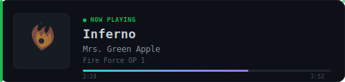

<p align="center"></p>

<p align="center"></p>

```typescript
// ~/about.ts
// ─────────────────────────────────────────────────────────────────────

const profile = {
  name: "Patricio Antonio García Pérez Vela",
  role: "Software Engineer & Learning AI Development",
  location: "Guanajuato, México 🇲🇽",
  education: "B.Sc. Computer Systems Engineering — UGTO",
  gpa: "9.4 / 10.0",
  status: "Graduated — Dec 2025",
  focus: ["Sovereign AI", "Full-Stack", "NLP"],
  building: ["WisprLocal", "Nue.ai", "DEMOX"],
  philosophy: "Hay que dar un paso a la vez. Solo uno a la vez.",
}

export default profile
```

```typescript
// ~/stack.ts
// ─────────────────────────────────────────────────────────────────────

const stack = {
  languages: ["Python", "TypeScript", "JavaScript", "Go", "C#", "C++"],
  frontend:  ["React", "Next.js", "Vue", "NuxtJS", "Flutter"],
  backend:   ["FastAPI", "Node.js", "Express", ".NET"],
  ai:        ["TensorFlow", "PyTorch", "spaCy", "Whisper", "Ollama"],
  databases: ["PostgreSQL", "MongoDB", "Redis", "SQL Server"],
  devops:    ["Docker", "Git", "Linux", "WSL2", "Fly.io", "Render"],
}
```

```typescript
// ~/projects.ts
// ─────────────────────────────────────────────────────────────────────

const projects = [
  {
    name: "WisprLocal",
    desc: "Sovereign voice AI — local STT + TTS + LLM on RTX 4060 / WSL2",
    tech: ["Python", "Whisper", "Ollama", "CUDA"],
  },
  {
    name: "Nue.ai",
    desc: "AI-powered style assistant — GPT-4o + Gemini Vision",
    tech: ["Python", "FastAPI", "Next.js"],
  },
  {
    name: "DEMOX",
    desc: "Political intelligence platform — NLP + pgvector",
    tech: ["FastAPI", "Next.js", "spaCy", "Supabase", "Docker"],
  },
  {
    name: "infinite-tic-tac-toe",
    desc: "Recursive strategy game engine",
    tech: ["TypeScript", "React"],
  },
]
```

```typescript
// ~/experience.ts
// ─────────────────────────────────────────────────────────────────────

const experience = [
  {
    company: "Mazda Motor Mexico",
    role: "Software Engineer (Intern)",
    period: "Aug 2025 → Feb 2026",
    highlights: [
      "Built end-to-end DMS in C# / .NET + SQL Server",
      "Cut document-search time & eliminated manual errors",
    ],
  },
]
```

```typescript
// ~/contact.ts
// ─────────────────────────────────────────────────────────────────────

const contact = {
  email:    "pa.garciaperezvela@ugto.mx",
  linkedin: "linkedin.com/in/patricioagpv",
  github:   "github.com/p5Patricio",
}
```

<p align="center">
  <a href="mailto:pa.garciaperezvela@ugto.mx">Email</a> ·
  <a href="https://www.linkedin.com/in/patricioagpv/">LinkedIn</a> ·
  <a href="https://github.com/p5Patricio">GitHub</a>
</p>

<p align="center">
  <picture>
    <source media="(prefers-color-scheme: dark)" srcset="https://raw.githubusercontent.com/p5Patricio/p5Patricio/output/github-snake-dark.svg"/>
    <source media="(prefers-color-scheme: light)" srcset="https://raw.githubusercontent.com/p5Patricio/p5Patricio/output/github-snake.svg"/>
    
  </picture>
</p>

<p align="center"></p>
