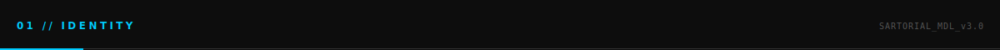
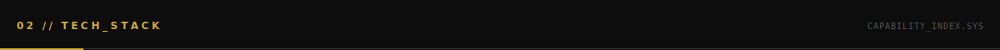
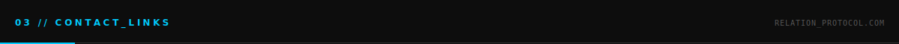
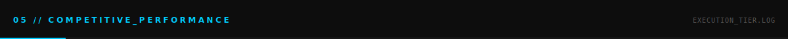
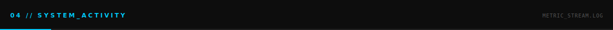

<p align="center"></p>

<p align="center"></p>

```typescript
// ~/identity/profile.sys
// ─────────────────────────────────────────────────────────────────────

const IDENTITY = {
  name:  "Patricio Antonio García Pérez Vela",
  role:  "Software Engineer & AI Researcher",
  loc:   "Guanajuato, MX",
  edu:   "B.Sc. Computer Systems Engineering — UGTO",
  build: ["WisprLocal", "Nue.ai", "DEMOX"],
  motto: "One step at a time."
}
```

<p align="center"></p>

```json
{
  "CORE_LANGS": ["Python", "TypeScript", "Go", "C#", "C++"],
  "FRONTEND":   ["React", "Next.js", "Vue", "Flutter"],
  "BACKEND":    ["FastAPI", "Node.js", "Express", ".NET"],
  "AI_STACK":   ["TensorFlow", "PyTorch", "Whisper", "Ollama"],
  "INFRA":      ["Docker", "Git", "Linux", "PostgreSQL", "MongoDB"]
}
```

<p align="center"></p>

<p align="center">
  <a href="mailto:pa.garciaperezvela@ugto.mx">
    
  </a>
  <a href="https://www.linkedin.com/in/patricioagpv/">
    
  </a>
  <a href="https://github.com/p5Patricio">
    
  </a>
</p>

<p align="center"></p>

<p align="center">
  
  
</p>

<p align="center" style="font-family: monospace; color: #555; font-size: 12px; letter-spacing: 0.2em;">
  OVERWATCH_GRANDMASTER // ROCKET_LEAGUE_DIAMOND
</p>

<p align="center"></p>

<p align="center">
  <picture>
    <source media="(prefers-color-scheme: dark)" srcset="https://raw.githubusercontent.com/p5Patricio/p5Patricio/output/github-snake-dark.svg"/>
    <source media="(prefers-color-scheme: light)" srcset="https://raw.githubusercontent.com/p5Patricio/p5Patricio/output/github-snake.svg"/>
    
  </picture>
</p>

<p align="center"></p>
