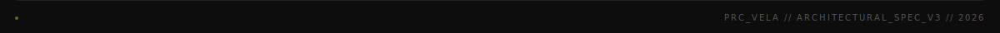

<p align="center">
  
</p>

<p align="center">
  <a href="https://github.com/p5Patricio"></a>
  &nbsp;
  
  &nbsp;
  <a href="https://github.com/p5Patricio?tab=repositories"></a>
</p>

<p align="center">
  <a href="https://git.io/typing-svg">
    
  </a>
</p>

<br/>

<p align="center"></p>

<br/>

<h3 align="center">🏯 &nbsp; About Me</h3>

<br/>

```yaml
name: Patricio García
role: Systems Engineer & Full Stack Developer
location: Guanajuato, México 🇲🇽
philosophy: "花は桜木、人は武士"

currently_building:
  - name: DEMOX
    desc: Political news intelligence platform
    stack: [FastAPI, Next.js, Supabase, Celery, spaCy, Gemini AI]
  - name: VoiceAgenda
    desc: Voice-controlled Android agenda app
    stack: [React Native, Expo, Node.js]

interests:
  - AI agent frameworks & developer tooling
  - Linux exploration (dual-boot enthusiast)
  - Polished technical documentation
  - Gaming: Overwatch 2, Rocket League, Fortnite
```

<br/>

<p align="center"></p>

<br/>

<h3 align="center">🌿 &nbsp; Tech Ecosystem</h3>

<br/>

<h4 align="center">Languages</h4>
<p align="center">
  
</p>

<h4 align="center">Frameworks & Libraries</h4>
<p align="center">
  
</p>

<h4 align="center">Data & Infrastructure</h4>
<p align="center">
  
</p>

<h4 align="center">DevOps & Deployment</h4>
<p align="center">
  
</p>

<br/>

<p align="center"></p>

<br/>

<h3 align="center">🤖 &nbsp; AI & Developer Tooling</h3>

<br/>

<p align="center">

| Tool | Use Case |
|:---:|:---|
|  | Primary AI coding assistant & agent |
|  | AI-enhanced code editor |
|  | Local LLM runtime (qwen3:8b) |
|  | Cloud AI analysis (2.5 Flash) |
|  | Local NLP processing |

</p>

<br/>

<p align="center"></p>

<br/>

<h3 align="center">🏆 &nbsp; GitHub Trophies</h3>

<br/>

<p align="center">
  
</p>

<br/>

<p align="center"></p>

<br/>

<h3 align="center">📊 &nbsp; GitHub Stats</h3>

<br/>

<p align="center">
  
  &nbsp;&nbsp;
  
</p>

<br/>

<p align="center">
  
</p>

<br/>

<p align="center">
  
</p>

<br/>

<p align="center"></p>

<br/>

<h3 align="center">🎮 &nbsp; Beyond the Code</h3>

<br/>

<p align="center">

```
  🎯 Overwatch 2     ⚽ Rocket League     🏗️ Fortnite
  🐧 Linux distros   🔧 AI agents         🎨 Dev tooling
```

</p>

<p align="center">
  
  &nbsp;
  
  &nbsp;
  
</p>

<br/>

<p align="center"></p>

<br/>

<h3 align="center">🔗 &nbsp; Connect</h3>

<br/>

<p align="center">
  <a href="mailto:tu-email@example.com">
    
  </a>
  &nbsp;&nbsp;
  <a href="https://linkedin.com/in/tu-perfil">
    
  </a>
  &nbsp;&nbsp;
  <a href="https://github.com/p5Patricio">
    
  </a>
</p>

<br/><br/>

<p align="center">
  
</p>
