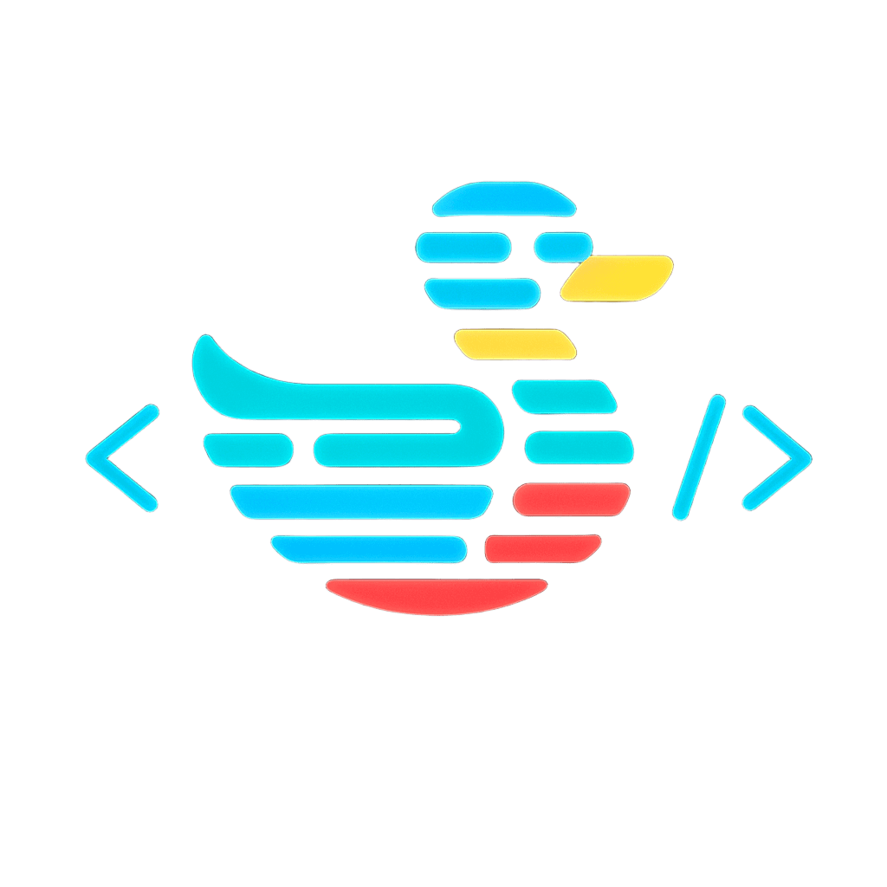
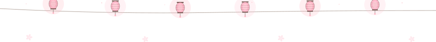

<!--
  Patricio García — GitHub profile README
  Theme: Yozakura Profundo (deep night sakura)
  Every divider is intentionally different so the page reads as one continuous night-scene, not a stack of sections.
-->

<p align="center">
  
</p>

<p align="center">
  <a href="https://github.com/p5Patricio"></a>
  &nbsp;
  
  &nbsp;
  <a href="https://github.com/p5Patricio?tab=repositories"></a>
  &nbsp;
  <a href="https://www.linkedin.com/in/patricioagpv/"></a>
</p>

<p align="center">
  <a href="https://git.io/typing-svg">
    
  </a>
</p>

<br/>

<p align="center"></p>

<br/>

<h3 align="center">🏯 &nbsp; About Me</h3>

<br/>

<table align="center" border="0" cellpadding="12" style="border:none;">
  <tr>
    <td align="center" valign="middle" width="180" style="border:none;">
      
    </td>
    <td valign="middle" style="border:none;">

```yaml
name: Patricio Antonio García Pérez Vela
role: Software Engineer & Learning AI Development
location: Guanajuato, México 🇲🇽
degree:
  title: B.Sc. Computer Systems Engineering
  school: Universidad de Guanajuato (DICIS)
  gpa: "9.4 / 10.0"
  status: Graduated — Dec 2025

philosophy: "One step at a time. Only one at a time. The hunter does not rush the moon."

currently_building:
  - Nue.ai       # AI-driven style assistant · GPT-4o + Gemini Vision
  - DEMOX        # Political intelligence · FastAPI + Next.js + pgvector
  - VoiceAgenda  # Voice-controlled Android agenda

focus:
  - Sovereign AI — local LLMs, local voice, local inference
  - Agent frameworks & developer tooling
  - NLP pipelines with spaCy + Gemini + Whisper
```

</td>
  </tr>
</table>

<br/>

<p align="center"></p>

<br/>

<h3 align="center">🌿 &nbsp; Tech Ecosystem</h3>

<br/>

<h4 align="center">Languages</h4>
<p align="center">
  
</p>

<h4 align="center">Frameworks &amp; Libraries</h4>
<p align="center">
  
</p>

<h4 align="center">AI &amp; Data Science</h4>
<p align="center">
  
</p>

<h4 align="center">Databases</h4>
<p align="center">
  
</p>
<p align="center">
  
</p>

<h4 align="center">Cloud &amp; DevOps</h4>
<p align="center">
  
</p>
<p align="center">
  
  &nbsp;
  
  &nbsp;
  
</p>

<br/>

<p align="center"></p>

<br/>

<h3 align="center">🤖 &nbsp; AI &amp; Developer Tooling</h3>

<p align="center"><i>The toolbox I actually use — daily, deliberately, with intent.</i></p>

<br/>

<table align="center">
  <tr>
    <th align="left">Tool</th>
    <th align="left">Role in my workflow</th>
  </tr>
  <tr>
    <td></td>
    <td>Primary AI coding agent — pair architect, refactor, SDD workflows</td>
  </tr>
  <tr>
    <td></td>
    <td>AI coding tool — fast codebase exploration and autonomous edits</td>
  </tr>
  <tr>
    <td></td>
    <td>Moonshot AI — long-context reasoning for research and architecture</td>
  </tr>
  <tr>
    <td></td>
    <td>Local LLM runtime — <code>qwen3:8b</code>, <code>llama3.1</code>, private inference</td>
  </tr>
  <tr>
    <td></td>
    <td>Cloud multimodal analysis — 2.5 Flash for NLP, Vision for Nue.ai</td>
  </tr>
  <tr>
    <td></td>
    <td>faster-whisper on CUDA (RTX 4060) — real-time local transcription</td>
  </tr>
  <tr>
    <td></td>
    <td>On-prem NLP — entity extraction for DEMOX political pipeline</td>
  </tr>
  <tr>
    <td></td>
    <td>Spec-Driven Development — propose → spec → design → tasks → apply</td>
  </tr>
  <tr>
    <td></td>
    <td>Engram (persistent memory), Stitch (design), Gmail/Calendar bridges</td>
  </tr>
  <tr>
    <td></td>
    <td>CUDA + Linux tooling on Windows — where all the local AI actually runs</td>
  </tr>
</table>

<br/>

<p align="center"></p>

<br/>

<h3 align="center">🚀 &nbsp; Featured Projects</h3>

<br/>

<table align="center">
  <tr>
    <td width="50%" valign="top">

### 👗 Nue.ai
*AI-powered personal style assistant · `Feb 2026 — present`*

Digital wardrobe platform with vision-model pipelines (GPT-4o + Gemini) for automated garment classification and contextual outfit recommendations driven by occasion, weather, and user preference.

`Python` `FastAPI` `Next.js` `GPT-4o` `Gemini Vision`

</td>
    <td width="50%" valign="top">

### 🗞️ DEMOX
*Political intelligence platform · `2025 — 2026`*

Real-time NLP pipeline for political entity extraction and sentiment analysis. Semantic search with `pgvector` cross-references news against a curated Guanajuato-state actors database. Async processing with Celery/Redis.

`FastAPI` `Next.js` `spaCy` `Gemini 2.5 Flash` `Supabase` `Docker`

</td>
  </tr>
  <tr>
    <td width="50%" valign="top">

### 🎙️ Local Whisper Voice Infrastructure
*Sovereign voice transcription · `March 2026`*

Deployed `faster-whisper` with GPU acceleration (RTX 4060/CUDA) for sub-second local transcription — zero external API dependency. Evaluated tiny → large-v3 for precision/VRAM tradeoffs under WSL2.

`Python` `Whisper` `CUDA` `WSL2`

</td>
    <td width="50%" valign="top">

### 🏀 NBA Player Analyzer
*Unsupervised ML playstyle profiling · `Feb — May 2025`*

K-Means clustering over NBA API data to surface latent player archetypes beyond traditional position labels. Interactive Next.js dashboard for cluster exploration.

`Python` `Scikit-Learn` `Pandas` `Next.js` `TypeScript`

</td>
  </tr>
  <tr>
    <td width="50%" valign="top">

### 🌾 Fitodex
*Agrochemical inventory management · `Aug 2024 — Jan 2025`*

Secure RESTful API deployed on Fly.io for chemical inventory control in agricultural operations. Flutter mobile client with offline-first sync.

`Node.js` `Express` `MongoDB Atlas` `Flutter` `Fly.io`

</td>
    <td width="50%" valign="top">

### 🗣️ VoiceAgenda
*Voice-controlled Android agenda · `in progress`*

Hands-free scheduling app with on-device voice recognition and natural-language intent parsing. Built for accessibility-first agenda management.

`React Native` `Expo` `Node.js`

</td>
  </tr>
</table>

<br/>

<p align="center"></p>

<br/>

<h3 align="center">💼 &nbsp; Experience</h3>

<br/>

<table align="center">
  <tr>
    <td valign="top" width="220">
      
      <br/>
      <sub><i>Software Engineer (Intern)</i></sub><br/>
      <sub>Aug 2025 — Feb 2026</sub>
    </td>
    <td valign="top">
      Built an end-to-end document management system (DMS) critical to plant IT — cut document-search time dramatically and guaranteed full traceability across factory floor operations.
      <br/><br/>
      Designed the SQL Server schema and business logic in <b>C# / .NET</b>, with automated validations and scheduled reports that eliminated manual errors across multiple departments.
      <br/><br/>
      <code>C#</code> <code>.NET</code> <code>SQL Server</code> <code>Enterprise IT</code>
    </td>
  </tr>
</table>

<br/>

<p align="center"></p>

<br/>

<h3 align="center">📊 &nbsp; GitHub Stats</h3>

<br/>

<p align="center">
  
  &nbsp;&nbsp;
  
</p>

<p align="center">
  
</p>

<p align="center">
  
</p>

<p align="center">
  
</p>

<br/>

<p align="center"></p>

<br/>

<h3 align="center">🎮 &nbsp; Beyond the Code</h3>

<br/>

<p align="center">

```
  🎯 Overwatch 2     ⚽ Rocket League     🏗️ Fortnite
  🐧 Linux distros   🔧 AI agents         📚 Technical writing
```

</p>

<p align="center">
  
  &nbsp;
  
  &nbsp;
  
</p>

<br/>

<p align="center"></p>

<br/>

<h3 align="center">🔗 &nbsp; Connect</h3>

<br/>

<p align="center">
  <a href="mailto:pa.garciaperezvela@ugto.mx">
    
  </a>
  &nbsp;&nbsp;
  <a href="https://www.linkedin.com/in/patricioagpv/">
    
  </a>
  &nbsp;&nbsp;
  <a href="https://github.com/p5Patricio">
    
  </a>
</p>

<br/>

<p align="center">
  <sub><i>"The end justifies the means."</i></sub>
</p>

<br/><br/>

<p align="center">
  
</p>
