<!--
  Patricio García — GitHub profile README
  Theme: Compiler (dark engineering / IDE aesthetic)
  Built for engineers who read code before prose.
-->

<p align="center">
  
</p>

<p align="center">
  <a href="https://github.com/p5Patricio"></a>
  &nbsp;
  
  &nbsp;
  <a href="https://github.com/p5Patricio?tab=repositories"></a>
  &nbsp;
  <a href="https://www.linkedin.com/in/patricioagpv/"></a>
</p>

<p align="center">
  <a href="https://git.io/typing-svg">
    
  </a>
</p>

<br/>

<p align="center"></p>

<br/>

<h3 align="center"><code>~/about</code> &nbsp; About Me</h3>

<br/>

<table align="center" border="0" cellpadding="12" style="border:none;">
  <tr>
    <td align="center" valign="middle" width="180" style="border:none;">
      
    </td>
    <td valign="middle" style="border:none;">

```yaml
name: Patricio Antonio García Pérez Vela
role: Software Engineer & Learning AI Development
location: Guanajuato, México 🇲🇽
degree:
  title: B.Sc. Computer Systems Engineering
  school: Universidad de Guanajuato (DICIS)
  gpa: "9.4 / 10.0"
  status: Graduated — Dec 2025

philosophy: "One step at a time. Only one at a time."

currently_building:
  - WisprLocal      # Sovereign voice AI — local STT + TTS + LLM
  - Nue.ai          # AI-driven style assistant — GPT-4o + Gemini Vision
  - DEMOX           # Political intelligence — FastAPI + Next.js + pgvector

focus:
  - Sovereign AI — local LLMs, local voice, local inference
  - Agent frameworks & developer tooling
  - NLP pipelines with spaCy + Gemini + Whisper
```

</td>
  </tr>
</table>

<br/>

<p align="center"></p>

<br/>

<h3 align="center"><code>~/stack</code> &nbsp; Tech Stack</h3>

<br/>

<h4 align="center">Languages</h4>
<p align="center">
  
</p>

<h4 align="center">Frameworks & Libraries</h4>
<p align="center">
  
</p>

<h4 align="center">AI & Data Science</h4>
<p align="center">
  
</p>

<h4 align="center">Databases</h4>
<p align="center">
  
</p>
<p align="center">
  
</p>

<h4 align="center">Cloud & DevOps</h4>
<p align="center">
  
</p>
<p align="center">
  
  &nbsp;
  
  &nbsp;
  
</p>

<br/>

<p align="center"></p>

<br/>

<h3 align="center"><code>~/tools</code> &nbsp; AI & Developer Tooling</h3>

<p align="center"><i>The toolbox I actually use — daily, deliberately, with intent.</i></p>

<br/>

<table align="center">
  <tr>
    <th align="left">Tool</th>
    <th align="left">Role in my workflow</th>
  </tr>
  <tr>
    <td></td>
    <td>Primary AI coding agent — pair architect, refactor, SDD workflows</td>
  </tr>
  <tr>
    <td></td>
    <td>Moonshot AI — long-context reasoning for research and architecture</td>
  </tr>
  <tr>
    <td></td>
    <td>Local LLM runtime — <code>qwen3:8b</code>, <code>llama3.1</code>, private inference</td>
  </tr>
  <tr>
    <td></td>
    <td>Cloud multimodal analysis — 2.5 Flash for NLP, Vision for Nue.ai</td>
  </tr>
  <tr>
    <td></td>
    <td><code>faster-whisper</code> on CUDA (RTX 4060) — real-time local transcription</td>
  </tr>
  <tr>
    <td></td>
    <td>On-prem NLP — entity extraction for DEMOX political pipeline</td>
  </tr>
  <tr>
    <td></td>
    <td>Spec-Driven Development — propose → spec → design → tasks → apply</td>
  </tr>
  <tr>
    <td></td>
    <td>Engram (persistent memory), Stitch (design), Gmail/Calendar bridges</td>
  </tr>
  <tr>
    <td></td>
    <td>CUDA + Linux tooling on Windows — where all the local AI actually runs</td>
  </tr>
</table>

<br/>

<p align="center"></p>

<br/>

<h3 align="center"><code>~/projects</code> &nbsp; Featured Projects</h3>

<br/>

<table align="center">
  <tr>
    <td width="50%" valign="top">

### WisprLocal
*Sovereign voice AI infrastructure · `2026 — present`*

Local-first voice assistant stack: <code>faster-whisper</code> for STT, Ollama for LLM reasoning, and a local TTS pipeline — all running on RTX 4060 under WSL2. Zero cloud dependency for voice interactions.

`Python` `Whisper` `Ollama` `CUDA` `WSL2`

</td>
    <td width="50%" valign="top">

### Nue.ai
*AI-powered personal style assistant · `Feb 2026 — present`*

Digital wardrobe platform with vision-model pipelines (GPT-4o + Gemini) for automated garment classification and contextual outfit recommendations driven by occasion, weather, and user preference.

`Python` `FastAPI` `Next.js` `GPT-4o` `Gemini Vision`

</td>
  </tr>
  <tr>
    <td width="50%" valign="top">

### DEMOX
*Political intelligence platform · `2025 — 2026`*

Real-time NLP pipeline for political entity extraction and sentiment analysis. Semantic search with <code>pgvector</code> cross-references news against a curated Guanajuato-state actors database. Async processing with Celery/Redis.

`FastAPI` `Next.js` `spaCy` `Gemini 2.5 Flash` `Supabase` `Docker`

</td>
    <td width="50%" valign="top">

### infinite-tic-tac-toe
*Recursive strategy game engine · `2026`*

A TypeScript-powered recursive tic-tac-toe game with nested board logic, built as a showcase of algorithmic thinking and clean state management.

`TypeScript` `React` `Algorithms`

</td>
  </tr>
  <tr>
    <td width="50%" valign="top">

### NBA Player Analyzer
*Unsupervised ML playstyle profiling · `Feb — May 2025`*

K-Means clustering over NBA API data to surface latent player archetypes beyond traditional position labels. Interactive Next.js dashboard for cluster exploration.

`Python` `Scikit-Learn` `Pandas` `Next.js` `TypeScript`

</td>
    <td width="50%" valign="top">

### Fitodex
*Agrochemical inventory management · `Aug 2024 — Jan 2025`*

Secure RESTful API deployed on Fly.io for chemical inventory control in agricultural operations. Flutter mobile client with offline-first sync.

`Node.js` `Express` `MongoDB Atlas` `Flutter` `Fly.io`

</td>
  </tr>
</table>

<br/>

<p align="center"></p>

<br/>

<h3 align="center"><code>~/experience</code> &nbsp; Experience</h3>

<br/>

<table align="center">
  <tr>
    <td valign="top" width="220">
      
      <br/>
      <sub><i>Software Engineer (Intern)</i></sub><br/>
      <sub>Aug 2025 — Feb 2026</sub>
    </td>
    <td valign="top">
      Built an end-to-end document management system (DMS) critical to plant IT — cut document-search time dramatically and guaranteed full traceability across factory floor operations.
      <br/><br/>
      Designed the SQL Server schema and business logic in <b>C# / .NET</b>, with automated validations and scheduled reports that eliminated manual errors across multiple departments.
      <br/><br/>
      <code>C#</code> <code>.NET</code> <code>SQL Server</code> <code>Enterprise IT</code>
    </td>
  </tr>
</table>

<br/>

<p align="center"></p>

<br/>

<h3 align="center"><code>~/stats</code> &nbsp; GitHub Stats</h3>

<br/>

<p align="center">
  
  &nbsp;&nbsp;
  
</p>

<p align="center">
  
</p>

<p align="center">
  
</p>

<p align="center">
  
</p>

<br/>

<p align="center"></p>

<br/>

<h3 align="center"><code>~/connect</code> &nbsp; Connect</h3>

<br/>

<p align="center">
  <a href="mailto:pa.garciaperezvela@ugto.mx">
    
  </a>
  &nbsp;&nbsp;
  <a href="https://www.linkedin.com/in/patricioagpv/">
    
  </a>
  &nbsp;&nbsp;
  <a href="https://github.com/p5Patricio">
    
  </a>
</p>

<br/>

<p align="center">
  <sub><i><code>"The end justifies the means."</code></i></sub>
</p>

<br/><br/>

<p align="center">
  
</p>
