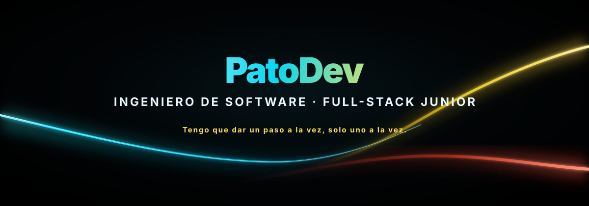

<p align="center">
  
</p>

<p align="center">
  <a href="https://patodev.com"></a>
  <a href="https://www.linkedin.com/in/patricioagpv/"></a>
  <a href="mailto:pa.garciaperezvela@ugto.mx"></a>
</p>

<p align="center"></p>

```ts
const patricio = {
  name: 'Patricio Antonio García Pérez Vela',
  alias: 'PatoDev',
  location: 'Guanajuato, México',
  role: 'Ingeniero de Software · Desarrollador full-stack junior',
  focus: ['software útil', 'automatización', 'interfaces cuidadas', 'IA aplicada'],
  education: 'Ingeniería en Sistemas Computacionales — Universidad de Guanajuato',
  workflow: 'desarrollo asistido por IA, validación humana y aprendizaje iterativo',
  principle: 'Tengo que dar un paso a la vez, solo uno a la vez.'
} as const
```

Soy desarrollador full-stack junior con base fuerte en **Python** y **TypeScript**. Me gusta construir productos completos: frontend con intención visual, backend con APIs claras, datos bien modelados y automatizaciones que ahorran tiempo real. Uso IA como copiloto técnico —para acelerar exploración, pruebas y refactor— sin dejar de revisar, ejecutar y entender lo que termino integrando.

<p align="center"></p>

| Área | Herramientas que aparecen en mis repos/proyectos |
| --- | --- |
| **Frontend** | TypeScript, React, Next.js, Vue, Vite, Tailwind CSS, HTML/CSS |
| **Backend & datos** | Python, FastAPI, Node.js/JavaScript, SQLAlchemy, PostgreSQL, pgvector |
| **IA / ML / datos** | Gemini, Whisper, Ollama/local LLMs, TensorFlow, MediaPipe, OpenCV, scikit-learn, pandas, NumPy |
| **Infra & flujo** | Docker, Git/GitHub, GitHub Actions, Linux, Vercel, Cloudflare |
| **Documentación** | Markdown, LaTeX, guías técnicas y bitácoras de instalación/configuración |

> Mantengo esta lista conservadora: prefiero quitar tecnologías antes que presumir algo que no esté respaldado por mis repositorios o mi trabajo reciente.

<p align="center"></p>

| Proyecto | Stack / alcance | Estado |
| --- | --- | --- |
| **[patodev.com](https://patodev.com)** · [repo](https://github.com/p5Patricio/portafolio) | Portafolio bilingüe en React + TypeScript + Vite + Tailwind v4; diseño oscuro con trazos SVG cian/amarillo/rojo. | Público |
| **[WisprLocal](https://github.com/p5Patricio/WisprLocal)** | Dictado por voz local con Python, Whisper, CUDA/NVIDIA y enfoque en privacidad. | Público |
| **D-MOX** · [frontend](https://github.com/p5Patricio/D-MOX---Frontend) / [backend](https://github.com/p5Patricio/D-MOX---Backend) | Plataforma de inteligencia política: Next.js/TypeScript, FastAPI, PostgreSQL + pgvector, NLP y Gemini. | Privado |
| **Rey Asesino** · [frontend](https://github.com/p5Patricio/reyasesino-frontend) / [backend](https://github.com/p5Patricio/reyasesino-backend) | E-commerce full-stack: Next.js/React, FastAPI, SQLAlchemy y almacenamiento de imágenes en Cloudflare R2. | Privado |
| **[EsteganoBOT](https://github.com/p5Patricio/EsteganoBOT-frontend)** · [backend](https://github.com/p5Patricio/EsteganoBOT-backend) | App full-stack de esteganografía en imágenes: Vue + JavaScript/Node. | Público |
| **[Intérprete LSM](https://github.com/p5Patricio/Interprete-LSM)** | Visión computacional para Lengua de Señas Mexicana con Python, MediaPipe y TensorFlow. | Público |
| **[Clasificador Entrenador NBA](https://github.com/p5Patricio/Clasificador_Entrenador-NBA)** | Proyecto de datos/ML con Python y scikit-learn sobre datos NBA. | Público |
| **[Symmetrical Code](https://github.com/p5Patricio/Symmetrical-Code)** | Experimentos de automatización y orquestación de agentes para flujos de generación de código. | Público |

También mantengo guías técnicas públicas sobre dual boot, entornos Windows para IA y herramientas de desarrollo asistido. Los experimentos o repos sin una historia clara no los presento aquí como productos terminados.

<p align="center"></p>

| Etapa | Qué me dejó |
| --- | --- |
| **Ingeniería en Sistemas Computacionales — Universidad de Guanajuato** | Fundamentos de algoritmos, estructuras de datos, desarrollo web, bases de datos, ML y visión por computadora. |
| **Prácticas profesionales — Mazda Motor Manufacturing** | Trabajo en entorno industrial, colaboración multidisciplinaria y desarrollo de soluciones internas para gestión/automatización de procesos. |
| **Desarrollo con IA** | Uso agentes y LLMs como apoyo diario para acelerar diseño, implementación, pruebas y documentación, manteniendo revisión humana sobre cada cambio importante. |

<p align="center"></p>

<p align="center">
  <a href="https://patodev.com"><strong>patodev.com</strong></a>
  ·
  <a href="https://www.linkedin.com/in/patricioagpv/">LinkedIn</a>
  ·
  <a href="mailto:pa.garciaperezvela@ugto.mx">Email</a>
  ·
  <a href="https://github.com/p5Patricio">GitHub</a>
</p>

<p align="center"></p>

<p align="center">
  <picture>
    <source media="(prefers-color-scheme: dark)" srcset="https://raw.githubusercontent.com/p5Patricio/p5Patricio/output/github-snake-dark.svg"/>
    <source media="(prefers-color-scheme: light)" srcset="https://raw.githubusercontent.com/p5Patricio/p5Patricio/output/github-snake.svg"/>
    
  </picture>
</p>

<p align="center"></p>
