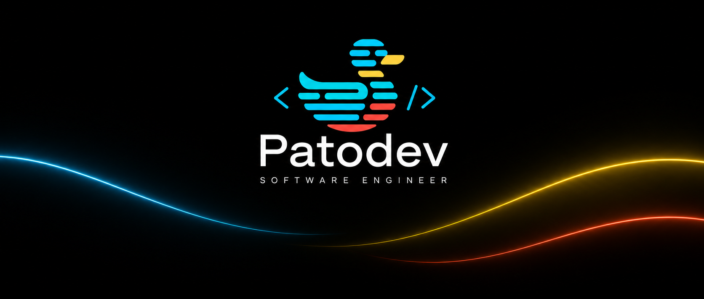

<p align="center">
  
</p>

<p align="center">
  <a href="https://patodev.com"></a>
  <a href="https://www.linkedin.com/in/patricioagpv/"></a>
</p>

<br/>
I am a Full-Stack Software Engineer building end-to-end applications with strong architectural foundations, responsive UIs, and robust backends. I leverage AI as a high-velocity copilot while maintaining strict engineering standards, code review, and domain ownership.

### ⚡ About Me

```ts
const developer = {
  name: "Patricio Antonio García Pérez Vela",
  alias: "PatoDev",
  role: "Full-Stack Software Engineer",
  location: "Guanajuato, Mexico",

  expertise: [
    "Production Full-Stack Systems",
    "AI & Agentic Workflows",
    "High-Performance APIs",
    "Clean Architecture & DX"
  ],

  stack: {
    frontend: ["TypeScript", "Next.js", "React", "Tailwind CSS v4"],
    backend: ["Python", "FastAPI", "Node.js", "PostgreSQL", "SQLAlchemy", "SQLite"],
    ai_ml: ["Whisper", "PyTorch", "MCP", "Gemini", "MediaPipe", "OpenCV"],
    infra: ["Docker", "Cloudflare R2 / MinIO", "Vercel", "GitHub Actions"]
  },

  philosophy: "One step at a time, just one at a time."
};
```

---

### 🚀 Featured Projects

#### 📊 [DEMOX](https://github.com/p5Patricio/DEMOX-Backend)
> **Political Media Intelligence Platform**
- **Tech:** Python, FastAPI, Next.js, PostgreSQL / Supabase, Pydantic, UV
- Analyst workspace for tracking political news, party analytics, sentiment signals, and evidence-backed reports in Guanajuato, Mexico. Includes automated news deduplication and UTF-8 JSON report exports.

#### 🎙️ [WhisperKey](https://github.com/p5Patricio/WhisperKey)
> **Local Offline GPU Voice Dictation**
- **Tech:** Python, PyTorch, OpenAI Whisper, Win32 / X11 API
- Zero-cloud, privacy-first bilingual voice dictation tool running directly on local GPU. Press a global hotkey, speak in Spanish or English, and instant transcription streams anywhere you type.

#### 📅 [mcp-agenda](https://github.com/p5Patricio/mcp-agenda)
> **Calendar Intelligence Server for AI Agents**
- **Tech:** TypeScript, SQLite, Model Context Protocol (MCP), Spanish NLP
- Zero-setup Model Context Protocol (MCP) server providing structured calendar intelligence, event parsing, and natural language query capabilities to autonomous AI agents.

#### 🛒 [Rey Asesino](https://github.com/p5Patricio/reyasesino-frontend)
> **E-Commerce Platform & Admin Suite**
- **Tech:** Next.js 16, React 19, FastAPI, Tailwind CSS v4, Cloudflare R2
- High-performance apparel store and management dashboard featuring on-the-fly WebP image optimization, server-rendered dynamic routing, and fast inventory administration.

#### 🎨 [ASCII Vision](https://github.com/p5Patricio/ASCII-Converter)
> **Vectorized ASCII & Braille Art Engine**
- **Tech:** Python, Computer Vision, Vectorized SSIM, RLE Exporters
- Headless image-to-ASCII processing engine utilizing bitmap glyph caching, structural similarity metrics (SSIM), and optimized HTML/SVG/ANSI exporters.

---

### 🛠️ Technical Stack Matrix

| Domain | Technologies |
| :--- | :--- |
| **Frontend & UI** | TypeScript, React 19, Next.js 16, Vue, Vite, Tailwind CSS v4, HTML5/CSS3 |
| **Backend & Databases** | Python 3.12+, FastAPI, Node.js, PostgreSQL, Supabase, SQLite, SQLAlchemy, SQLModel, Alembic |
| **AI, ML & Vision** | OpenAI Whisper, PyTorch, Model Context Protocol (MCP), Gemini API, OpenCV, MediaPipe, scikit-learn |
| **Storage & Infra** | Cloudflare R2, MinIO, Docker, Linux, GitHub Actions, Vercel, pnpm / uv |
| **Testing & Quality** | Playwright, Pytest, ESLint, Clean / Hexagonal Architecture |

---

<p align="center">
  <a href="https://patodev.com"><strong>patodev.com</strong></a>
  ·
  <a href="https://www.linkedin.com/in/patricioagpv/">LinkedIn</a>
  ·
  <a href="https://github.com/p5Patricio">GitHub</a>
</p>
